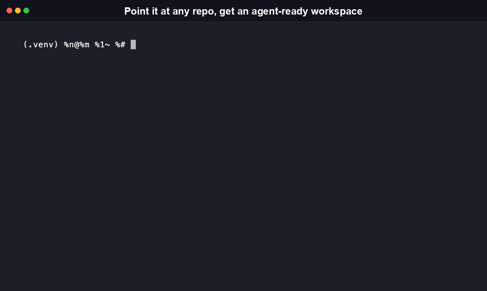
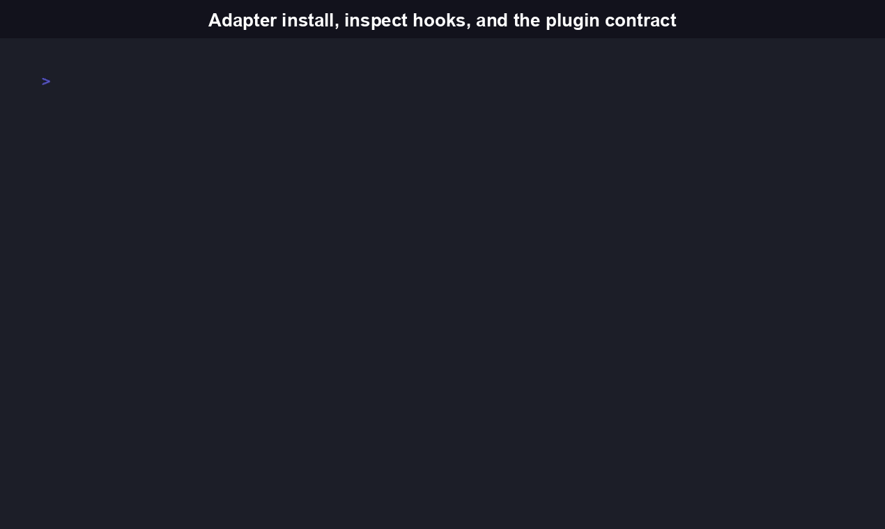

<!-- mcp-name: io.github.RudrenduPaul/agenticworkspace -->
# AgenticWorkspace

[](https://github.com/RudrenduPaul/AgenticWorkspace/actions/workflows/ci.yml)
[](./LICENSE)
[](https://www.npmjs.com/package/agenticworkspace-cli)
[](./package.json)
[](https://pypi.org/project/agenticworkspace-cli/)

Point it at any repo. It detects the stack, writes a `.workspace/` directory with progressive
context and session handoffs, and installs a working Claude Code adapter, all in one command.



```bash
npx agenticworkspace-cli init
```

This is a v0.1 release. Zero installs, zero GitHub stars, first release. 99/99 JavaScript tests
and 132/132 Python tests pass. It does what's described below and nothing more. There's an
honest comparison against the other tools already working in this space further down, so you can
decide if AgenticWorkspace is actually worth trying before you run it.

## Table of contents

- [Install](#install)
- [Features](#features)
- [Quickstart](#quickstart)
- [CLI reference](#cli-reference)
- [The `.workspace/` directory](#the-workspace-directory)
- [Library API reference](#library-api-reference)
- [Adapter status](#adapter-status-v01)
- [Extending AgenticWorkspace](#extending-agenticworkspace)
- [How this compares to repo-harness and harnesskit](#how-this-compares-to-repo-harness-and-harnesskit)
- [What and why](#what-and-why)
- [Development](#development)
- [FAQ](#faq)
- [Contributing](#contributing)
- [License](#license)

## Install

AgenticWorkspace ships two independent, equally first-class packages that
implement the same scan/scaffold/adapter pipeline and read/write the same
`.workspace/` directory shape -- pick whichever fits your toolchain, or
install both. Neither is deprecated in favor of the other.

```bash
# npm -- JavaScript/TypeScript CLI + library (live today, v0.1.3)
npx agenticworkspace-cli init
```

```bash
# PyPI -- Python CLI + library (live today, v0.1.1)
pip install agenticworkspace-cli
agenticworkspace init --path /path/to/your/repo
```

To install from source instead:

```bash
git clone https://github.com/RudrenduPaul/AgenticWorkspace.git
cd AgenticWorkspace/python
pip install -e .
agenticworkspace init --path /path/to/your/repo
```

For repeat use with the npm package, install it globally:

```bash
npm install -g agenticworkspace-cli
agenticworkspace init
```

The Python package's CLI entry point is also `agenticworkspace` (e.g.
`agenticworkspace init --path ./my-app`); see
[`python/README.md`](./python/README.md) and
[docs/getting-started.md](./docs/getting-started.md) for the Python-specific
walkthrough.

To build the TypeScript package from source instead:

```bash
git clone https://github.com/RudrenduPaul/AgenticWorkspace.git
cd AgenticWorkspace
npm install
npm run build
node dist/agenticworkspace/cli.js init
```

## Features

Everything below is verified against the actual source in this repo, not aspirational.

- **Real stack detection** -- language (JavaScript/TypeScript, Python, lighter-weight signals for
  Rust/Go/Ruby), package manager (npm/pnpm/yarn), and monorepo package count, read from real
  manifest files (`src/agenticworkspace/scan/stack-detector.ts`).
- **Non-destructive by default** -- checks for `CLAUDE.md`, `AGENTS.md`, `.cursor/rules`, and
  `.github/copilot-instructions.md` and never overwrites them
  (`src/agenticworkspace/scan/config-detector.ts`).
- **Detects other agent-memory tooling without touching it** -- looks for a `.serena/` directory, a
  GitNexus-style config, or repo-harness's own `.ai/harness/` directory, reports what it finds, and
  never reads or writes any of them (`src/agenticworkspace/memory-backends/`).
- **A real, working Claude Code adapter** -- writes actual hook scripts for session start,
  pre-tool-call, and session-end handoff generation, wired into
  `.workspace/adapters/claude-code/settings.json`
  (`src/agenticworkspace/adapters/claude-code/install.ts`).
- **Structured JSON output on every subcommand** -- `init`, `scan`, `status`, `adapter install`, and
  `handoff new` all support `--json`, including on error paths (a nonexistent `--path`, a missing
  workspace, an unimplemented adapter), so a calling agent never has to parse human-readable text
  or guess at exit codes.
- **Two documented plugin interfaces, not a hardcoded pipeline** -- `MemoryBackend`
  (`src/agenticworkspace/memory-backends/types.ts`) and `Adapter`
  (`src/agenticworkspace/adapters/types.ts`). Adding a new tool means implementing one interface
  and registering it (`registry.ts` in each folder); no changes to CLI or scan code are required.
  See [Extending AgenticWorkspace](#extending-agenticworkspace) below.
- **Shell-injection-safe hook generation** -- every scanned value (module names, paths) that ends
  up embedded in a generated shell script passes through an allowlist and quoting check first
  (`src/agenticworkspace/util/sanitize.ts`), covered by 30 dedicated unit tests (confirmed by
  running the suite directly, including the parameterized rejection cases).
- **Partial-state recovery** -- an interrupted or malformed prior `init` run is detected and
  surfaced (interactive repair/reset/abort prompt, or a structured JSON error with a dedicated exit
  code in `--json` mode) instead of being silently overwritten or resumed
  (`src/agenticworkspace/state/partial-state.ts`).
## Quickstart

A real run against a small two-file JavaScript repo (target path shortened to `/Users/you/my-app`
for readability, every field value below is the actual output):

```bash
$ agenticworkspace init --json --path ./my-app

{
  "ok": true,
  "agenticworkspace_version": "0.1.1",
  "scanned_at": "2026-08-04T06:18:25.620Z",
  "target": "/Users/you/my-app",
  "stack": {
    "language": "javascript",
    "package_manager": "npm",
    "monorepo": false,
    "packages": 1
  },
  "existing_config": {
    "claudeMd": false,
    "agentsMd": false,
    "cursorRules": false,
    "copilotInstructions": false,
    "anyDetected": false
  },
  "memory_backends": [
    { "name": "serena", "detected": false, "description": "Serena memory/context tool (.serena/ directory)" },
    { "name": "gitnexus", "detected": false, "description": "GitNexus-style config (.gitnexus/ or gitnexus.config.json)" },
    { "name": "repo-harness", "detected": false, "description": "repo-harness (.ai/harness/ directory) -- detected only, never modified" }
  ],
  "context": { "root_context_kb": 0.6, "budget_kb": 12, "modules": [] },
  "adapters": { "claude_code": { "installed": true, "hook_schema_version": "2026-07-01" } },
  "workspace_dir": "/Users/you/my-app/.workspace"
}
```

The `agenticworkspace_version` field in that output is a version string tracked separately from
the package's own npm/PyPI version (they can drift; treat it as an internal schema marker, not the
package version you installed).

That single run wrote seven real files on disk:

```
.workspace/workspace.json
.workspace/context/root-context.md
.workspace/adapters/claude-code/settings.json
.workspace/adapters/claude-code/adapter-meta.json
.workspace/adapters/claude-code/hooks/session-start.sh
.workspace/adapters/claude-code/hooks/pre-tool-call.sh
.workspace/adapters/claude-code/hooks/session-end-handoff.sh
```

Drop `--json` for a human-readable version of the same run:

```bash
$ agenticworkspace init --path ./my-app

AgenticWorkspace v0.1 -- Repo-to-Agent-Workspace Converter
Target: /Users/you/my-app

Scanning repository...
[OK] Stack detected: javascript, npm
[--] No existing agent-config files found
[--] No memory/context tool detected

Writing .workspace/ scaffold...
  .workspace/workspace.json                created
  .workspace/context/root-context.md        created (0.6KB of 12KB budget)
  .workspace/handoff/                       created (empty, ready for first session)

Installing Claude Code adapter...
  .workspace/adapters/claude-code/settings.json         written
  .workspace/adapters/claude-code/hooks/session-start.sh  written
  .workspace/adapters/claude-code/hooks/pre-tool-call.sh  written
  .workspace/adapters/claude-code/hooks/session-end-handoff.sh  written

Workspace ready. Next Claude Code session in this repo will load root-context.md automatically
and write a handoff file on exit.
```

Checking workspace health and writing a session handoff on that same repo, real output:

```bash
$ agenticworkspace status --path ./my-app

AgenticWorkspace status
Target: /Users/you/my-app
Last scan: 2026-08-04T06:18:25.620Z

Stack: javascript, npm, 1 package(s)
Context budget: 0.6KB of 12KB (0 module block(s))
Handoffs: 0 file(s), most recent: none
Claude Code adapter: installed, schema 2026-07-01, current
Other backends detected: none

$ agenticworkspace handoff new "test session" --path ./my-app

Handoff written: .workspace/handoff/2026-08-04-0618.md
```

See [docs/usage.gif](./docs/usage.gif) for a recorded run of `handoff new` and `status` together.

## Features

Everything below is verified against the actual source in this repo, not aspirational.

- **Real stack detection** -- language (JavaScript/TypeScript, Python, lighter-weight signals for
  Rust/Go/Ruby), package manager (npm/pnpm/yarn), and monorepo package count, read from real
  manifest files (`src/agenticworkspace/scan/stack-detector.ts`).
- **Non-destructive by default** -- checks for `CLAUDE.md`, `AGENTS.md`, `.cursor/rules`, and
  `.github/copilot-instructions.md` and never overwrites them
  (`src/agenticworkspace/scan/config-detector.ts`).
- **Detects other agent-memory tooling without touching it** -- looks for a `.serena/` directory, a
  GitNexus-style config, or repo-harness's own `.ai/harness/` directory, reports what it finds, and
  never reads or writes any of them (`src/agenticworkspace/memory-backends/`).
- **A real, working Claude Code adapter** -- writes actual hook scripts for session start,
  pre-tool-call, and session-end handoff generation, wired into
  `.workspace/adapters/claude-code/settings.json`
  (`src/agenticworkspace/adapters/claude-code/install.ts`).
- **Structured JSON output on every subcommand** -- `init`, `scan`, `status`, `adapter install`, and
  `handoff new` all support `--json`, including on error paths (a nonexistent `--path`, a missing
  workspace, an unimplemented adapter), so a calling agent never has to parse human-readable text
  or guess at exit codes.
- **Two documented plugin interfaces, not a hardcoded pipeline** -- `MemoryBackend`
  (`src/agenticworkspace/memory-backends/types.ts`) and `Adapter`
  (`src/agenticworkspace/adapters/types.ts`). Adding a new tool means implementing one interface
  and registering it (`registry.ts` in each folder); no changes to CLI or scan code are required.
  See [Extending AgenticWorkspace](#extending-agenticworkspace) below.
- **Shell-injection-safe hook generation** -- every scanned value (module names, paths) that ends
  up embedded in a generated shell script passes through an allowlist and quoting check first
  (`src/agenticworkspace/util/sanitize.ts`), covered by 30 dedicated unit tests.
- **Partial-state recovery** -- an interrupted or malformed prior `init` run is detected and
  surfaced (interactive repair/reset/abort prompt, or a structured JSON error with a dedicated exit
  code in `--json` mode) instead of being silently overwritten or resumed
  (`src/agenticworkspace/state/partial-state.ts`).

## CLI reference

Every command accepts `-p, --path <path>` (defaults to the current directory) and `--json`
(structured output instead of the human-readable default). Reference below is the actual
`--help` output from a locally built `agenticworkspace` binary.

| Command | Description |
|---|---|
| `agenticworkspace init` | Scan the repo and write the `.workspace/` scaffold plus the Claude Code adapter. Idempotent -- safe to re-run. |
| `agenticworkspace scan` | Detect stack and existing agent-tooling surface only. No writes. |
| `agenticworkspace status` | Report workspace health: stack, context budget usage, handoff count, adapter staleness. |
| `agenticworkspace adapter install <name>` | (Re)install a single adapter's hook wiring, e.g. `claude-code`. Returns `adapter_not_implemented` for `codex` or `cursor`. |
| `agenticworkspace handoff new <message>` | Write a new timestamped session handoff file under `.workspace/handoff/`. |

Exit codes are stable across `--json` and human-readable modes, so a script can branch on them
without parsing text. Verified directly: `adapter install codex` exits `3` with a "NOT YET
IMPLEMENTED" message, and `status` against a target with no `.workspace/` exits `4`.

| Code | Meaning |
|---|---|
| `0` | Success |
| `1` | General error (bad input, unexpected filesystem failure) |
| `2` | Partial/malformed `.workspace/` state detected |
| `3` | Adapter not yet implemented (`codex`, `cursor`) |
| `4` | No `.workspace/` found (run `init` first) |

## MCP Server

The Python package ships a Model Context Protocol (MCP) server, so an MCP-capable agent (Claude
Desktop, Claude Code, or any other MCP client) can call AgenticWorkspace as a tool instead of
shelling out to the CLI and parsing text itself.

```bash
pip install "agenticworkspace-cli[mcp]"
```

Add it to your MCP client config (stdio transport):

```json
{
  "mcpServers": {
    "agenticworkspace": {
      "command": "agenticworkspace-mcp"
    }
  }
}
```

It exposes a single tool, `run(args: list[str]) -> dict`, that shells out to the installed
`agenticworkspace` CLI with the given argument list and returns its parsed result -- every
subcommand (`init`, `scan`, `status`, `adapter install`, `handoff new`) is reachable through it, so
the MCP surface never drifts out of sync with the CLI as new subcommands are added. Every failure
mode (missing binary, timeout, non-zero exit, unparsable output) comes back as a `{"error": ...}`
dict instead of raising. Example call and result:

```
run(["scan", "--json", "--path", "/path/to/repo"])
-> {"ok": true, "target": "/path/to/repo", "stack": {"language": "javascript", ...}, ...}
```

## The `.workspace/` directory

```
.workspace/
  workspace.json              manifest: detected stack, adapters installed, schema version
  context/
    root-context.md           progressive root context, budget-targeted (~12KB)
    modules/
      auth.md                 per-module capability block, loaded on demand
      api.md
  handoff/
    2026-07-13-1421.md         one file per session, timestamped
  adapters/
    claude-code/
      settings.json           hook entries wired into Claude Code's settings schema
      hooks/
        session-start.sh       loads root-context.md + relevant module blocks
        pre-tool-call.sh        lightweight guard, extendable per project
        session-end-handoff.sh writes the next handoff/ file automatically
```

## Library API reference

Both packages export their scan/scaffold/adapter logic for programmatic use in addition to the
CLI binary. Signatures below are grepped directly from source.

### TypeScript (`agenticworkspace-cli`, `src/agenticworkspace/index.ts`)

```typescript
import {
  detectStack,
  detectExistingConfig,
  memoryBackendRegistry,
  detectAllMemoryBackends,
  adapterRegistry,
  getAdapter,
  runInitEngine,
  readManifest,
  writeManifest,
  sanitizeForShellEmbedding,
  validateAgainstAllowlist,
  shellQuote,
} from "agenticworkspace-cli";

async function detectStack(repoPath: string): Promise<StackDetectionResult>;
async function detectExistingConfig(repoPath: string): Promise<ExistingConfigResult>;
async function runInitEngine(repoPath: string, workspaceDir: string): Promise<InitEngineResult>;
function getAdapter(name: string): Adapter | undefined;
async function readManifest(workspaceDir: string): Promise<WorkspaceManifest | null>;
async function writeManifest(workspaceDir: string, manifest: WorkspaceManifest): Promise<void>;
function sanitizeForShellEmbedding(
  rawValue: unknown,
  warn?: SanitizeWarning,
  options?: SanitizeForShellOptions,
): string | null;
function validateAgainstAllowlist(rawValue: unknown): SanitizeResult;
function shellQuote(value: string): string;
```

`MemoryBackend` and `Adapter` are exported as TypeScript types for anyone implementing a new
plugin (`src/agenticworkspace/memory-backends/types.ts`, `src/agenticworkspace/adapters/types.ts`).

### Python (`agenticworkspace-cli` on PyPI, `python/src/agenticworkspace/__init__.py`)

```python
from agenticworkspace import (
    adapter_registry,
    get_adapter,
    memory_backend_registry,
    detect_all_memory_backends,
    Adapter,
    MemoryBackend,
    AGENTICWORKSPACE_VERSION,
)
```

`Adapter` and `MemoryBackend` are `abc.ABC` classes here rather than TypeScript interfaces --
implement one, add an instance to `adapter_registry` or `memory_backend_registry` (plain Python
lists), and no CLI or scan code changes are required. The package ships a `py.typed` marker, so
type checkers pick up its stubs without extra configuration.

## Adapter status (v0.1)

| Adapter | Status |
|---|---|
| Claude Code | Implemented, works end to end |
| Codex | Registered, not yet implemented |
| Cursor | Registered, not yet implemented |



## Extending AgenticWorkspace

AgenticWorkspace is built around two plugin interfaces, not one project doing everything itself:

- `MemoryBackend` (`src/agenticworkspace/memory-backends/types.ts`) -- detects whether a repo
  already has a memory/context tool wired in. Detection must stay read-only.
- `Adapter` (`src/agenticworkspace/adapters/types.ts`) -- wires the `.workspace/` scaffold into a
  specific coding tool: install, staleness check, and a human-readable description.

Adding support for a new tool means implementing one of these interfaces and registering an
instance in that folder's `registry.ts`; no changes to the CLI or scan code are required. See
`src/agenticworkspace/adapters/codex/` and `.../cursor/` for the shape a not-yet-implemented stub
takes (`isImplemented: false` plus a real `describe()` string), and `.../claude-code/` for a fully
working reference implementation.

The Python package (`pip install agenticworkspace-cli`) implements the same two interfaces as
`abc.ABC` classes with the same registration contract (`memory_backend_registry` /
`adapter_registry`, plain Python lists) -- see
[docs/integrations/custom-plugin.md](./docs/integrations/custom-plugin.md) for a worked example in
both languages.

## How this compares to repo-harness and harnesskit

Repo-local context and session-handoff tracking for coding agents is not a new idea. Before
building this, we checked what's already shipping. Two npm packages cover overlapping ground, and
their current state (checked 2026-08-03) matters more than any of our own claims about them:

| | **AgenticWorkspace** v0.1.3 (npm) / v0.1.1 (PyPI) | **repo-harness** v0.13.0 | **harnesskit** v0.1.1 |
|---|---|---|---|
| npm activity | 3 published versions (0.1.1 -> 0.1.3), created 2026-07-15, most recently published 2026-08-04 | 46 published versions, created 2026-05-28, last published 2026-08-03 (same day as this check) | 2 published versions, last published 2026-03-20 (about 4.5 months stale as of this check) |
| GitHub | 0 stars, 0 forks (new repo) | 402 stars, 29 forks, pushed 2026-08-03 | GitHub repo now returns 404, cannot inspect source |
| Claude Code adapter | Implemented end to end: real hook scripts + `settings.json` wiring, installed by `init` in the same run that creates the workspace | Implemented: `~/.claude/settings.json` hook adapter | Unverified, could not inspect source or README (npm page blocked our fetch, GitHub repo gone) |
| Codex adapter | Registered in the adapter interface, `install()` throws "not yet implemented" -- honest stub, not a silent no-op | Implemented: `~/.codex/hooks.json` adapter | Unverified |
| Cursor adapter | Registered, same honest-stub pattern as Codex | Not mentioned anywhere in the current README (a prior comparison found it referenced in architecture docs; that reference is gone as of this check) | Unverified |
| Progressive context loading | Budget-targeted root context file (~12KB) plus per-module capability blocks, loaded on demand | ~12KB stable root context plus ~1KB capability contracts loaded only for files actually being touched, backed by a CodeGraph structural index we do not build | Unverified |
| Session handoff files | Timestamped file per session under `handoff/` | `.ai/harness/handoff/` directory plus `tasks/current.md`, derived from workflow artifacts | Unverified |
| CLI JSON output | Every subcommand (`scan`, `status`, `adapter install`, `handoff`) supports `--json`, including error paths | Has JSON output on at least `--dry-run --json` and `state-snapshot --json` | Unverified |
| Detects other tools without touching them | Yes: checks for `.serena/`, a GitNexus-style config, and repo-harness's own `.ai/harness/` directory, reports what it finds, never reads or writes any of them | Not checked -- outside scope of what we reviewed | Unverified |
| Plugin/extension model | Two documented TypeScript interfaces (`MemoryBackend`, `Adapter`); adding a tool means implementing one and registering it, no CLI changes needed | Not verified from the README alone; would need to read source to confirm | Unverified |
| Hosted multi-repo dashboard | Does not exist. Not planned as part of this OSS CLI. | Does not exist, self-hosted file-backed workflow only | Unverified |
| Documentation languages | English only | English (primary), plus Simplified Chinese, Japanese, French, Spanish | Unverified |

What we could verify came from `npm view`, the GitHub API, and repo-harness's own README (fetched
directly). We did not install and run repo-harness against a real repo ourselves, so anything
marked "implemented" for it is a README claim we read, not a claim we reproduced firsthand.
Everything marked "unverified" for harnesskit stayed that way because its GitHub repository no
longer resolves and its npm page blocked automated fetches; we are not going to guess at what a
tool does from a description string. (A PyPI package also named `harnesskit` exists, but it is a
different, unrelated project by a different author -- a fuzzy string-replace tool for LLM coding
agents -- and we are not counting it here.)

repo-harness's own scope has grown since we last checked it: its README now centers on a
ChatGPT-driven MCP planning sidecar handing off to Codex for execution, on top of the
Claude/Codex hook adapters this table already covers. That is a materially bigger surface than
"repo-local context and handoff tracking," and worth knowing before you compare the two tools
project-to-project rather than feature-to-feature.

The honest read: repo-harness is more mature than AgenticWorkspace on almost every dimension in
this table right now. It already has a working Claude Code adapter, a working Codex adapter, and
five languages of documentation. It has been iterating fast (46 versions in a little over two
months). If you already use it and it works for you, there's no reason to switch.

What we actually built differently: a plugin architecture with two small, documented interfaces
(`MemoryBackend` for detecting other tools, `Adapter` for wiring into a specific coding agent)
instead of one project doing everything itself, and an explicit compatibility check that detects
repo-harness's own `.ai/harness/` directory and reports it rather than silently duplicating or
conflicting with it. Beyond that, right now, this is a new, unproven CLI going up against a more
established one. We're not going to dress that up.

One more thing worth naming: Claude Code itself now ships a first-party `MEMORY.md`-based memory
system and team memory stores, plus a `post-session` lifecycle hook that can snapshot uncommitted
work. It doesn't scan a repo's stack or install a Claude-Code-specific adapter the way
AgenticWorkspace does, but the gap between "what the platform does natively" and "what a tool like
this adds" is narrower than it was when this category started, and it's worth watching before
assuming any of this tooling stays necessary.

## What and why

Coding agents lose context the moment a session ends, and every repo needs its own manual setup
before an agent can work in it well: what CLAUDE.md or AGENTS.md file to write, how to hand off
partial work to the next session, which hooks to wire up. That setup is repetitive, easy to get
wrong, and rarely kept up to date as a project's stack changes.

AgenticWorkspace automates the parts of that setup that are mechanical and repo-agnostic: figuring
out what stack a repo uses, writing a progressive context file sized to stay inside a token budget
instead of the model's entire codebase, and installing real hooks so a Claude Code session
generates a handoff note automatically instead of relying on a human to write one down. It does not
try to be a memory database, a semantic code index, or a hosted dashboard. It is a scaffolding CLI:
it writes files once, in a format any of those other tools could later read or extend, and then
gets out of the way.

Why build another one of these when repo-harness already exists and has more traction (see the
comparison table above)? Because the honest answer is: not to displace it. This project exists to
test a narrower, Claude-Code-first version of the same idea with a plugin architecture that keeps
detection and adapter code decoupled from day one, and to be upfront in public about exactly how it
stacks up against the tool that got there first.

## Development

```bash
git clone https://github.com/RudrenduPaul/AgenticWorkspace.git
cd AgenticWorkspace
npm install
npm run build
npm test
```

99/99 tests pass as of this release. Before opening a pull request, run `npm run lint`,
`npm run typecheck`, `npm run test:coverage`, and `npm run build` -- the same steps CI runs on
Node 18.x and 20.x.

For the Python package instead:

```bash
cd python
python3 -m venv .venv && source .venv/bin/activate
pip install -e ".[dev]"
pytest
```

132/132 tests pass as of the Python package's initial release. See
[`python/README.md`](./python/README.md) for the Python-specific development notes.

## FAQ

**What is AgenticWorkspace, and what makes it different from writing a CLAUDE.md file by hand?**
It is a repo-to-agent-workspace converter: a single command (`agenticworkspace init`) scans a
repo's stack, writes a progressive, token-budgeted context file, and installs a working Claude
Code adapter with real hook scripts, all in one non-destructive run. The differentiator is that
this is automated and repo-agnostic rather than a template you copy and edit by hand, and it is
built around two documented plugin interfaces (`MemoryBackend`, `Adapter`) instead of one
hardcoded pipeline, so adding a new coding-agent adapter or memory backend does not require
touching the CLI or scan code.

**What are the install and platform requirements?**
The npm package requires Node.js 18 or later (`"engines": { "node": ">=18.0.0" }` in
`package.json`). The Python package requires Python 3.9 or later (`requires-python = ">=3.9"` in
`python/pyproject.toml`) and is classified `Operating System :: OS Independent` on PyPI. Both
packages are plain Node/Python with no native or OS-specific dependencies; day-to-day development
and testing happen on macOS and Linux, and Windows has not been separately verified by the
maintainers.

**Does this modify my existing CLAUDE.md, AGENTS.md, or .cursor/rules?**
No. `init` checks for all four config files (`CLAUDE.md`, `AGENTS.md`, `.cursor/rules`,
`.github/copilot-instructions.md`) and reports what it finds, but never writes to or overwrites any
of them.

**Does this conflict with Serena, GitNexus, or repo-harness if I already use one of them?**
No. Detection is read-only: AgenticWorkspace checks for `.serena/`, a GitNexus-style config, and
repo-harness's `.ai/harness/` directory, reports what it finds in `scan`/`status`/`init` output, and
never reads, writes, or deletes anything inside them.

**How does this actually compare to repo-harness, the most established alternative?**
See the [full comparison table](#how-this-compares-to-repo-harness-and-harnesskit) above for the
complete, dated breakdown. In short: repo-harness is more mature on almost every measurable axis
right now (more published versions, more GitHub stars, a working Codex adapter, five documentation
languages, and a broader MCP-planner-plus-Codex-execution scope). What AgenticWorkspace does
differently is a smaller, two-interface plugin architecture and an explicit, read-only
compatibility check for repo-harness's own `.ai/harness/` directory. If repo-harness already works
for you, there is no reason in this table to switch.

**What happens if `init` gets interrupted halfway through?**
The next `init` run detects the leftover `.init-in-progress` marker or a missing/malformed
`workspace.json` and either prompts you to repair, reset, or abort (interactive terminal), or
returns a structured JSON error with exit code `2` (non-interactive or `--json` mode) instead of
silently overwriting or resuming.

**Why isn't the Codex or Cursor adapter implemented yet?**
Both are registered in the `Adapter` plugin interface with `isImplemented: false` and a real, honest
`describe()` string rather than a silent no-op. Claude Code was built first because that is the
adapter this repo's own workflow was built and tested against. Contributions implementing either are
welcome, see [Extending AgenticWorkspace](#extending-agenticworkspace).

**Is there a hosted dashboard or paid tier?**
Not in this repository. This CLI is the free, local, MIT-comparable (Apache-2.0) layer. There is no
hosted component here to sign up for.

**What license is this, and can I use it commercially?**
Apache License 2.0 (see [LICENSE](./LICENSE)). It permits commercial use, modification, private
use, and distribution, and includes an express patent grant, subject to preserving the license and
copyright notice and carrying no warranty.

**Is there a Python version?**
Yes -- a genuine Python port (not a wrapper around the Node binary), with the same CLI shape, the
same `.workspace/` output, and the same `MemoryBackend`/`Adapter` plugin contract, plus its own
importable library surface (`Adapter` and `MemoryBackend` as `abc.ABC` classes). See
[`python/README.md`](./python/README.md) for the Python-specific install and usage walkthrough.

## Contributing

See [CONTRIBUTING.md](./CONTRIBUTING.md) for the development setup, the pre-PR checklist, and
concrete instructions for adding a new `MemoryBackend` or `Adapter`. Security-sensitive changes
(anything that touches generated shell scripts) must go through the shared sanitization module
described there.

## License

Apache 2.0. See [LICENSE](./LICENSE).
